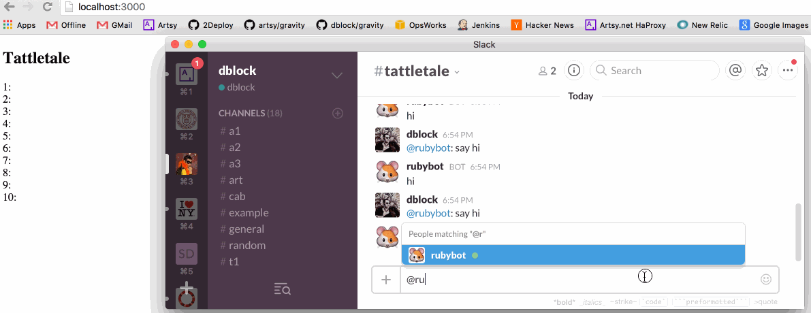

Slack-Bot-On-Rails
==================

[](https://travis-ci.org/slack-ruby/slack-bot-on-rails)

### What's this?

A slack bot that responds to `say`, running on Rails with a React front-end that displays messages.

### Run Me

In Slack administration create a new Bot Integration under [services/new/bot](http://slack.com/services/new/bot). On the next screen note the Slack API token.


```
bundle install

SLACK_API_TOKEN="your token here" rails s
```

Navigate to http://localhost:3000.

Invite the bot to a channel, then ask it to `say hi`.



### Deploy to Heroku

Hit the button below and update the `SLACK_API_TOKEN` config variable with your [token](http://slack.com/services/new/bot)

[](https://heroku.com/deploy?template=https://github.com/dblock/slack-bot-on-rails)

### Implementation Details

1. A vanilla Rails app created via `rails new slack-bot-on-rails --skip-activerecord -T`, in [@d092f4ed](https://github.com/dblock/slack-bot-on-rails/commit/d092f4ed7f16aee27cdfde837a3a420df182f81a).
2. A slack-ruby-bot that responds to `say something`, in [@a93877ae](https://github.com/dblock/slack-bot-on-rails/commit/a93877ae77d0fa1935b1c847af61dab346a46b78).
3. A react app that displays messages sent to Slack, in [@9632e9f1](https://github.com/dblock/slack-bot-on-rails/commit/9632e9f157bc97eab15c5588bc493550eb2ac5ba).

### Copyright & License

Copyright [Daniel Doubrovkine](http://code.dblock.org), [MIT License](LICENSE.md).
